# Phonegap Development Setup (with admob)

Guide on how to setup a mac osx in order to start developing phonegap applications. I'm using it to build android apps but the same development environment can be used to develop iOS applications also.

Please refer to phonegap's documentation to get the extra help you might need.

[Phonegap Android Guide](http://docs.phonegap.com/en/edge/guide_platforms_android_index.md.html#Android%20Platform%20Guide)

[Phonegap iOS Guide](http://docs.phonegap.com/en/edge/guide_platforms_ios_index.md.html#iOS%20Platform%20Guide)
  

### prerequisites:
- NodeJS - [my instruction guide](https://github.com/b-rucel/code-snippets/tree/master/mac.node_setup)
- android SDK ver: [latest SDK](http://developer.android.com/sdk/index.html)

I just use the SDK Tools instead of entire IDE. I'm using
[24.3.4](http://dl.google.com/android/android-sdk_r24.3.4-macosx.zip) at the time of this writing.

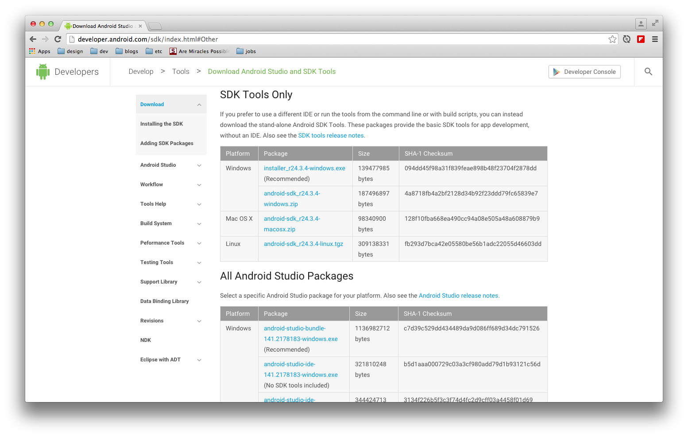
  

unzip the contents of the file android-sdk_r24.3.4-macosx.zip

open terminal

    cd ~/Desktop/
    mv android-sdk-macosx ~/android

set up system path for sdk tools: i use .bash_profiles

    export ANDROID_HOME=/Users/bruce/android
    export PATH=${PATH}:$ANDROID_HOME/tools:$ANDROID_HOME/platform-tools

after that I ran the android SDK manager from cli

    ~/android/tools/android

More requirements to install when I ran android: 

install java first

SDK manager window opens then you can choose which android version SDK tools you want to download

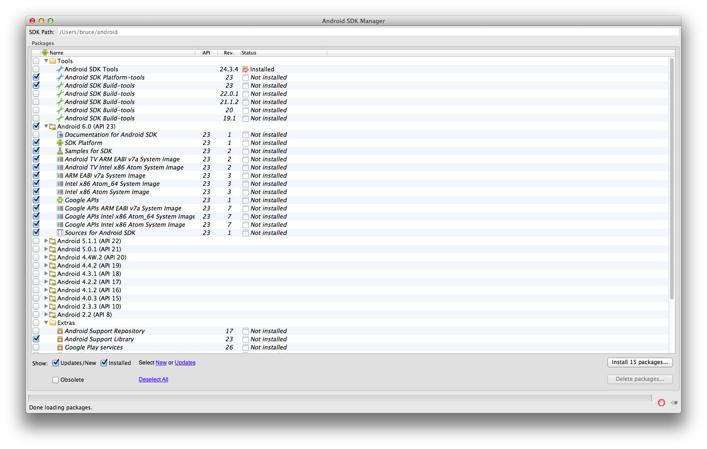

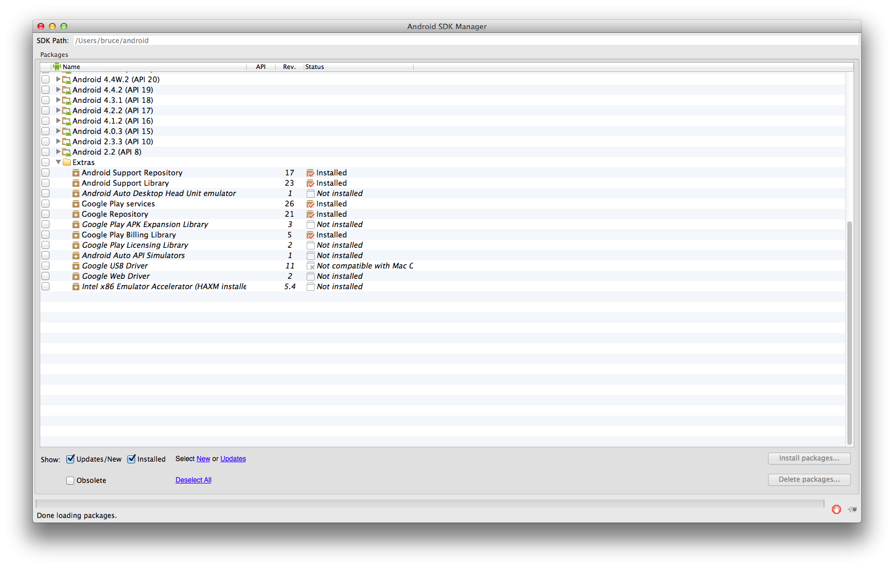

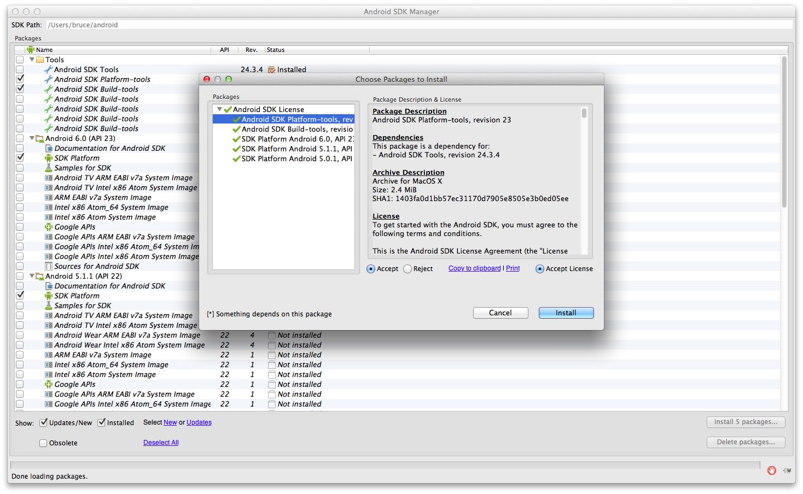

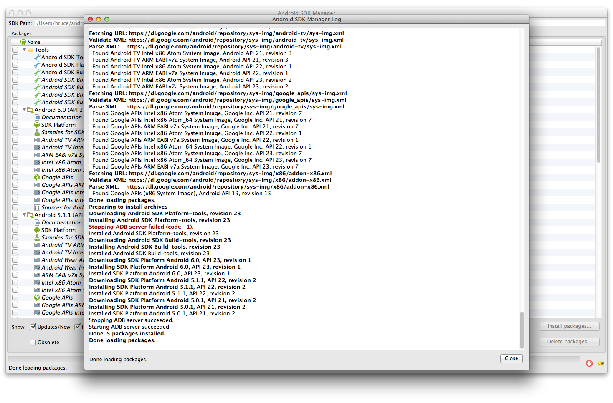

make sure java and ant are executable

install apache ant

    brew install ant

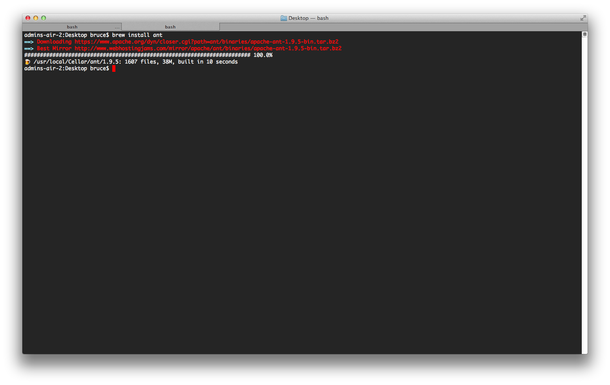

install cordova cli tool

    npm install -g cordova

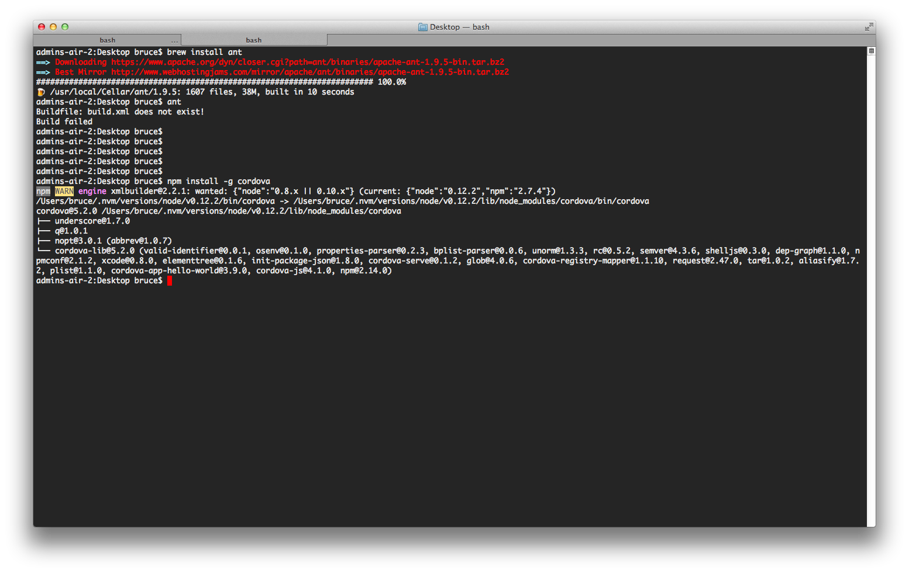

Now you can create a corodva project from the command line, go through the next few steps:

    cordova create hello com.example.hello HelloWorld

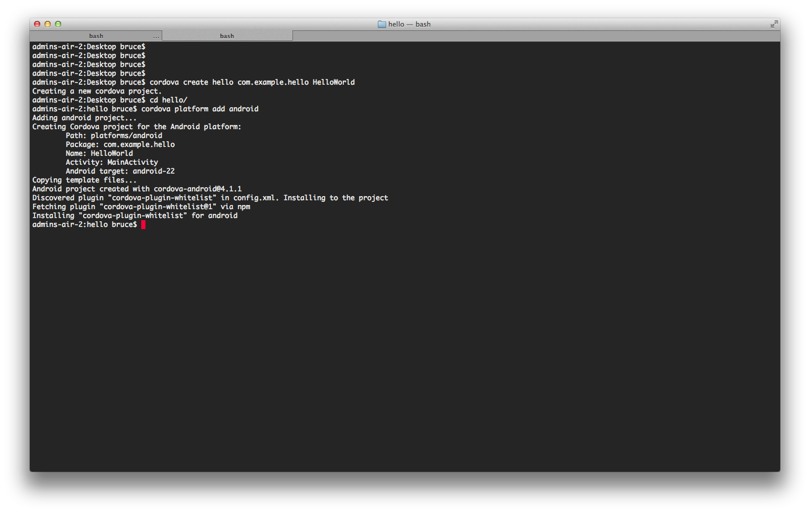

building android apk

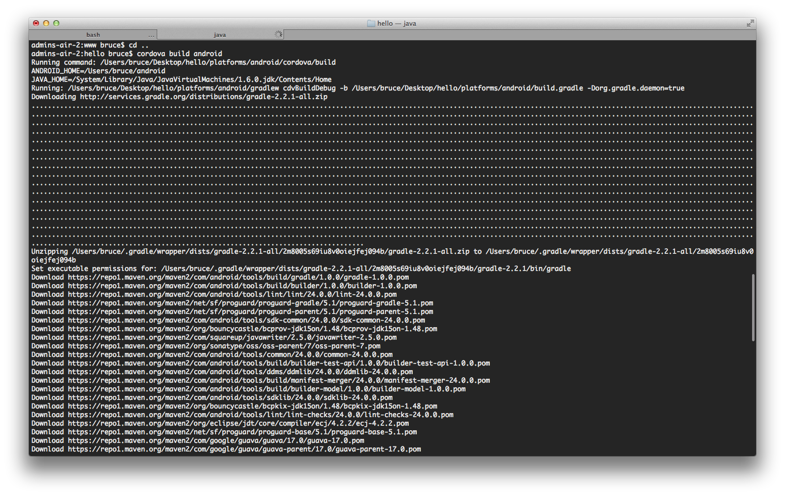

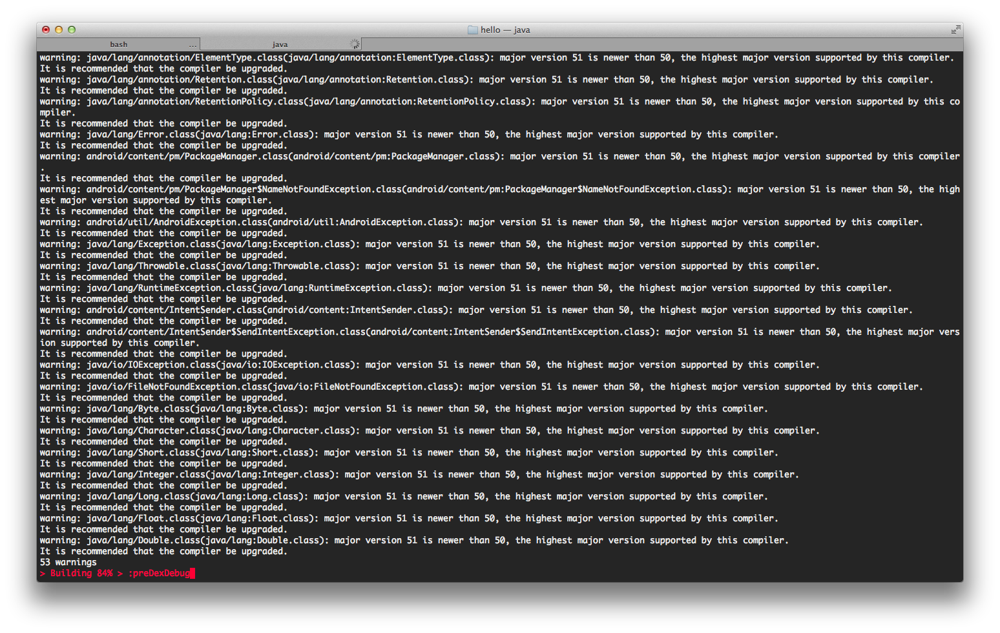

I had warning message appear during my android build process.

first fix was because of the outdated java compiler (JSE)

JAVA 8 fixed this.

http://www.oracle.com/technetwork/java/javase/downloads/jdk8-downloads-2133151.html

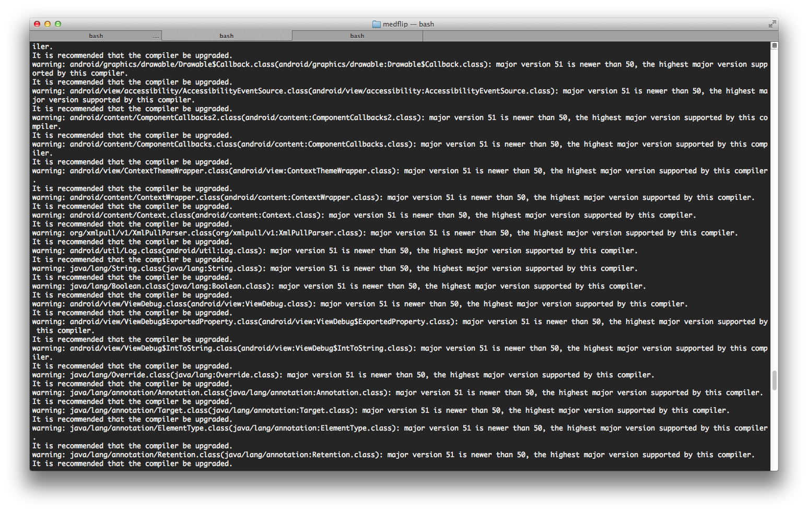

few things about trying to add admob plugins

it used be managed by a different plugin - maybe an older version of this plugin but it is not available.

before rjfun something plugin

https://github.com/floatinghotpot/cordova-admob-pro

will now try to make an app with the new admob plugin to make it work

